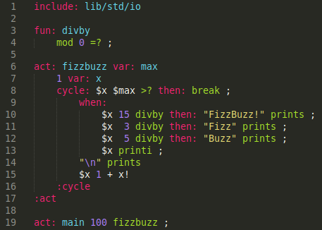

# dryft
*Dryft* is an experimental stack-based concatenative programming language, featuring:
- a very simple but extensible syntax
- pure and impure function distinction 
- Linear types and stack based resource management 
- Full (optional) type inference

