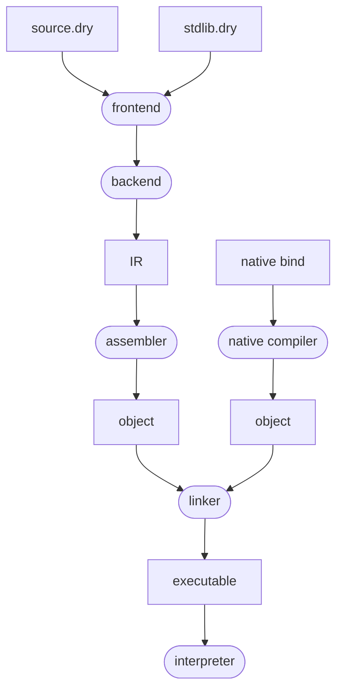

# Build graph

```mermaid
flowchart TD
source[source.dry] --> frontend([frontend])
stdlib[stdlib.dry] --> frontend
frontend --> backend([backend])
backend --> IR[IR]
IR --> assembler([assembler])
assembler --> obj1[object]
nativebind[native bind] --> nativecompiler([native compiler ])
nativecompiler --> obj2[object]
obj1 --> linker([linker])
obj2 --> linker([linker])
linker --> executable[executable]
executable --> interpreter([interpreter])
```
